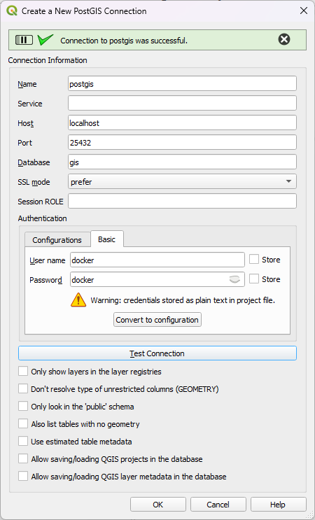

# Databases

MapServer can connect to most geospatial databases. There are native MapServer drivers for [PostgreSQL/PostGIS](https://mapserver.org/input/vector/postgis.html),
[Oracle](https://mapserver.org/input/vector/oracle.html), and [Microsoft SQL Server](https://mapserver.org/input/vector/mssql.html).Other databases
can be accessed through OGR e.g. [MySQL](https://mapserver.org/input/vector/mysql.html).

In this exercise we'll be connecting to a PostGIS database. [PostGIS](https://postgis.net/) spatially enables the [PostgreSQL](https://www.postgresql.org/)
databases. To avoid having to install and setup a database we'll be using the [PostGIS Docker image](https://hub.docker.com/r/kartoza/postgis/) provided
by [Kartoza](https://kartoza.com/).

If you have QGIS installed on your machine you can check you can successfully connect to the database by opening the
[browser panel](https://docs.qgis.org/3.34/en/docs/user_manual/managing_data_source/opening_data.html#the-browser-panel), and
creating a new PostgreSQL connection:

<figure markdown="span">
  
  <figcaption>The QGIS Browser Panel</figcaption>
</figure>

<figure markdown="span">
  { width="320" }
  <figcaption>Connecting to the Database with QGIS</figcaption>
</figure>

!!! tip

    - When connecting to the database from another Docker container port `5432` is used, and the host name is `db`
      as defined in the `docker-compose.yml` file.

    - When connecting from your own machine port `25434` is used (this is chosen to avoid clashes with any locally running databases).

## Adding Data to The Database

We can use the OGR tool [ogr2ogr](https://gdal.org/programs/ogr2ogr.html) installed on the MapServer container to add datasets to the PostgreSQL database.

```bash
# connect to the MapServer Docker image which includes OGR tools for importing data
docker exec -it mapserver bash
# navigate to the folder containing the OSM FlatGeobuf files
cd /etc/mapserver/data/osm
# import the water polygons dataset to the Postgres database in the Postgres Docker image
ogr2ogr -f "PostgreSQL" PG:"dbname=gis user=docker password=docker host=db port=5432" -nln water_a water_a.fgb
# now check the data details in the database
ogrinfo PG:"host=db user=docker password=docker dbname=gis port=5432" water_a -summary
```

## Code

The example map below shows water polygon features, read from PostgreSQL, and displayed as a WMS by MapServer.

<div class="map">
  <iframe src="https://geographika.github.io/getting-started-with-mapserver-demo/postgis.html"></iframe>
</div>

!!! example "Exercise Links"

    - MapServer request: <http://localhost:5000/?map=/etc/mapserver/postgis.map&mode=map&layer=water>
    - OpenLayers example: <http://localhost:5001/postgis.html>

??? JavaScript "postgis.js"

    ```js
    --8<-- "postgis.js"
    ```

??? Mapfile "postgis.map"

    ``` scala
    --8<-- "postgis.map"
    ```

## Exercises

- Try and load another dataset into the database using the `ogr2ogr` approach above.
- Now add a new layer to the Mapfile to display the layer. You can make a direct request to MapServer in the form:
  <http://localhost:5000/?map=/etc/mapserver/postgis.map&mode=map&layers=water%20NEWLAYERNAME>.
- Now update the JS file so the layer is visible as part of the interactive map, through WMS:

  ```js
    source: new ImageWMS({
        url: mapserverUrl + mapfilesPath + 'postgis.map&',
        params: { 'LAYERS': 'water,NEWLAYERNAME', 'STYLES': '' },
        ratio: 1
    }),
  ```