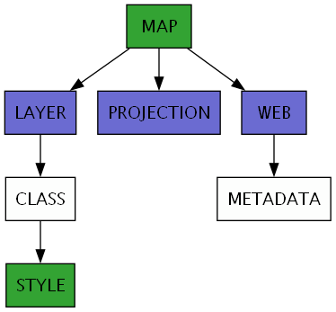

# Line Styling

## Overview

In this exercise we're going to display the road network from OpenStreetMap for Tartu, Estonia - the host
city for [FOSS4G Europe 2024](https://2024.europe.foss4g.org/) where this workshop was first given. 

<div class="map">
  <iframe src="https://geographika.github.io/getting-started-with-mapserver-demo/lines.html"></iframe>
</div>

The diagram below shows the Mapfile directives used for the map:




## Layers

A MapServer [LAYER](https://mapserver.org/mapfile/layer.html) represents
a dataset that will be displayed in your map. In this example we have a single "roads" layer, defined below:

```scala
LAYER
  NAME "roads"
  TYPE LINE
  STATUS OFF
  ...
```

Key attributes for the layer are:

- the [NAME](https://mapserver.org/mapfile/layer.html#mapfile-layer-name) is used by client applications to refer to the `LAYER` and should be unique.
- the [STATUS](https://mapserver.org/mapfile/layer.html#mapfile-layer-status) is a slightly confusing property. When we use a client application such as OpenLayers, we want to set this to `OFF` and let the client request layers. A `STATUS` of `default` means the layer will always be visible whether the client requests it or not.
- all layers have a [TYPE](https://mapserver.org/mapfile/layer.html#mapfile-layer-type) which decides how the layer should be drawn. We use a simple `LINE` type to display the roads.

## Data Sources

To define the data for the layer we need to set the [DATA](https://mapserver.org/mapfile/layer.html#mapfile-layer-data) property:

```scala
LAYER
  ...
  CONNECTIONTYPE FLATGEOBUF
  DATA "data/osm/roads.fgb"
```

MapServer can display many different [vector formats](https://mapserver.org/input/vector/index.html). In this case we are pointing to a FlatGeobuf file on disk so we set the [CONNECTIONTYPE](https://mapserver.org/mapfile/layer.html#mapfile-layer-connectiontype) to [FLATGEOBUF](https://mapserver.org/input/vector/flatgeobuf.html). FlatGeobuf can be simpler to use than Shapefiles, as they are a single file and don't have any restrictions on attribute names. 

The path to the `roads.fgb` is added to the `DATA` property and is relative to the Mapfile. 

## Styling

In this example all roads will be in the same `CLASS` and displayed in a single `STYLE`:

```scala
CLASS
  STYLE
    COLOR 50 50 50
  END
END
```

## Code

!!! example

    - Direct MapServer request: <http://localhost:5002/?map=/etc/mapserver/lines.map&mode=map&layer=roads>
    - Local OpenLayers example: <http://localhost:5001/lines.html>

!!! tip

    Note the layer name in `layer=roads` is case-sensitive and had to match the LAYER NAME in the Mapfile
    exactly.

??? JavaScript "lines.js"

    ``` js
    --8<-- "lines.js"
    ```

??? Mapfile "lines.map"

    ``` scala
    --8<-- "lines.map"
    ```

## Exercises

1. Change the `STYLE` to use a different RGB colour. 
2. Add a [WIDTH](https://www.mapserver.org/mapfile/style.html#mapfile-style-width) property to the `STYLE`.
2. Add a second `STYLE` block to the `CLASS`, but use a larger width to create stacked lines. Styles are drawn in the order they appear in the Mapfile.
3. Experiment with adding a [PATTERN](https://www.mapserver.org/mapfile/style.html#mapfile-style-pattern) to the line style for example `PATTERN 5 5 END`.

