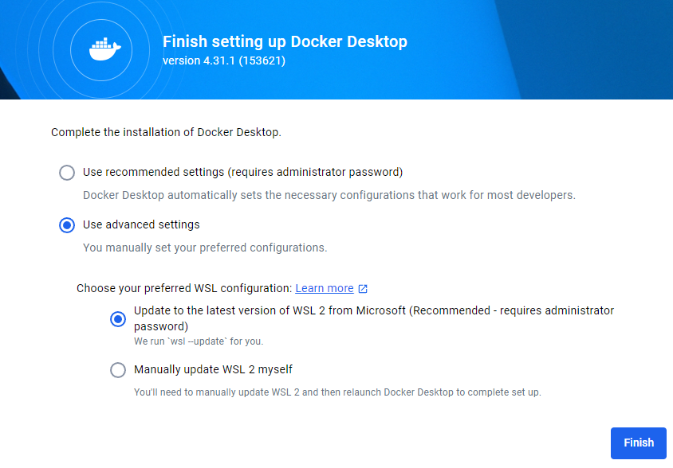

# Workshop Environment Setup

In this workshop we use the following materials:

1. **Documentation** - (like this page): the latest versions are available online [here](https://geographika.github.io/getting-started-with-mapserver/)
2. **Exercises** - download the [latest zip file](https://github.com/geographika/getting-started-with-mapserver/archive/refs/heads/main.zip), unzip, 
   and find exercises in `workshop/exercises`.

The first step is to download and unzip the `main.zip` file to a local folder on your system. 
Alternatively, if you are familiar with `git` and have it installed you can fork/clone the GitHub repository of this 
workshop directly from <https://github.com/geographika/getting-started-with-mapserver/>.

## Text editor

Your text editor needs to be able to edit files in **plain text**. Below are some choices
for text editors (there may be others):

* Notepad or Notepad++ (Windows)
* Sublime Text
* IntelliJ IDEA
* Emacs
* Visual Studio Code
* `vi` / `vim`

Having said this, please feel free to use what works for you :)

## Docker

The main requirement for the training is to install Docker with Docker Compose on your system.
We strongly advise to install Docker before the workshop starts.

MapServer can be installed directly to various operating systems (see the [documentation](https://www.mapserver.org/installation/index.html)
for more information), but Docker is used so a fully reproducible environment can be setup.

[Docker Compose](https://docs.docker.com/compose) is an addition to Docker to facilitate
the orchestration (configuration) of one or more Docker 'Containers' (a Container is a running instance of a Docker image)
using a configuration convention (the Docker Compose YAML file), usually named `docker-compose.yml`.

## Docker Installation

Docker installation has greatly progressed over the years. This is the only part of the workshop
which is dependent on the system/OS you are running (e.g. Windows, Mac or Linux). For each
system the Docker website provides detailed installation instructions. Please follow these consistently.

For many platforms a product called `Docker Desktop` is available, which includes `Docker compose`:

* Windows [installation](https://docs.Docker.com/desktop/install/windows-install) - install "Docker Desktop for Windows - x86_64"
* Mac [installation](https://docs.Docker.com/desktop/install/mac-install)
* Linux [installation](https://docs.Docker.com/desktop/install/linux-install)

Some installation notes for different operating systems:

### Windows

* We recommend using the [Windows Subsystem for Linux](https://docs.microsoft.com/en-us/windows/wsl) (WSL) as it also provides a powerful (Bash) command line and has optimal integration with Docker. You can choose this option when installing Docker:

  

  When you first run Docker you can then update to the latest WSL version:

  


* If you get "WSL update failed" you may need to manually run `wsl --update`
* Admin access is likely required to install Docker. You may then need to add your local account to the docker-users group as [explained here](https://stackoverflow.com/questions/58663920/), and restart your machine. 

### Mac

* If you are using [Homebrew](https://brew.sh), consider using the [brew Docker formula](https://formulae.brew.sh/formula/Docker)
* On MacOS Monterey, there is an issue with the port 5000 that is already used and therefore conflicting to the default one used by MapServer. 
  If you are facing with this error `OSError: [Errno 48] Address already in use` then you need to can disable the *Airplay Receiver* from `System Preference->Sharing` of your MacOS (detailed description in this blog [post](https://progressstory.com/tech/port-5000-already-in-use-macos-monterey-issue/)).

### Linux

* You can choose the relevant installer for your platform. You can also use Virtualbox with a Ubuntu image or use a cloud VM
* Docker Desktop includes a graphical user interface with some interesting options. You can see logs and information about running containers, open their service in a browser or even open a terminal inside the container

### OSGeoLive

The steps below are based on [Install Docker Engine on Ubuntu](https://docs.docker.com/engine/install/ubuntu/#install-using-the-repository) and have been tested on the OSGeoLive 16.0 virtual machine.

```bash
# Add Docker's official GPG key:
sudo apt-get update
sudo apt-get install ca-certificates curl
sudo install -m 0755 -d /etc/apt/keyrings
sudo curl -fsSL https://download.docker.com/linux/ubuntu/gpg -o /etc/apt/keyrings/docker.asc
sudo chmod a+r /etc/apt/keyrings/docker.asc

# Add the repository to Apt sources:
echo \
  "deb [arch=$(dpkg --print-architecture) signed-by=/etc/apt/keyrings/docker.asc] https://download.docker.com/linux/ubuntu \
  $(. /etc/os-release && echo "$VERSION_CODENAME") stable" | \
  sudo tee /etc/apt/sources.list.d/docker.list > /dev/null
sudo apt-get update

# Install the Docker packages
sudo apt-get install -y docker-ce docker-ce-cli containerd.io docker-buildx-plugin docker-compose-plugin

# Test with Docker test image
sudo service docker start
sudo docker run hello-world

# Setup the workshop
cd /home
sudo git clone https://github.com/geographika/getting-started-with-mapserver/
cd /home/getting-started-with-mapserver/workshop/exercises/
sudo docker compose up

# Test the following URLs in a browser
# http://localhost:5000
# http://localhost:5001/lines.html
```

### Testing the Docker installation

If all goes well, you should be able to run Docker from the command line as follows:

```bash
docker --version
# Docker version 28.2.2, build e6534b4

docker compose version
# Docker Compose version v2.36.2-desktop.1
```

Your version numbers don't have to match those above exactly.

## Quickstart

Once Docker is available on your system, running the workshop containers with MapServer and all required datasets
is a one-liner. 

```bash
# make sure you are in the directory that contains docker-compose.yml
cd /getting-started-with-mapserver/workshop/exercises/
# now start the containers
docker compose up --detach
```

The first time this command is run it will start downloading the containers - this may take several minutes depending on your Internet connection.
On Windows you may be prompted to let Docker access ports through your Windows Firewall. 

When this command is next run it should only take a few seconds to start. The `detach` flag means the containers will run in the background so we 
can continue to use the shell. If you want to stop the containers you can run:

```bash
docker compose down
```

Once the containers are downloaded you can test they are running and you can connect to them. Open a web browser
and navigate to <http://localhost:5000/>. You should see the following message:

```bash
loadParams(): Web application error. No query information to decode. QUERY_STRING is set, but empty.
```

This is good! It means MapServer is running. Next we can check that the front-end container is running by opening <http://localhost:5001/points.html>.
Hopefully you'll see a map, and we're ready to start the workshop.

## Possible Errors

* The error `error during connect: this error may indicate that the docker daemon is not running` indicates that the Docker service isn't running. You will need to start Docker. On Windows you can do this by opening Docker Desktop. If it is still failing try running it as Administrator.
* `docker: Cannot connect to the Docker daemon at unix:///var/run/docker.sock. Is the docker daemon running?` - the Docker service isn't running. Start it with `sudo service docker start`.
* `E: Could not get lock /var/lib/dpkg/lock-frontend. It is held by process 46288 (unattended-upgr)` is caused
by another program trying to update Ubuntu. Rebooting may fix this, or you can try running `sudo kill <process_id>` for example in this case `sudo kill 46288`. 
* `docker-desktop : Depends: docker-ce-cli but it is not installable` - you are attempting to install Docker Desktop, but have not yet installed the Docker Engine.
* `unable to get image 'node:lts-slim': error during connect: in the default daemon configuration on Windows, the docker client must be 
   run with elevated privileges to connect: Get "http://%2F%2F.%2Fpipe%2Fdocker_engine/v1.50/images/node:lts-slim/json": open //./pipe/docker_engine: The system cannot find the file specified.`
   - you will need 